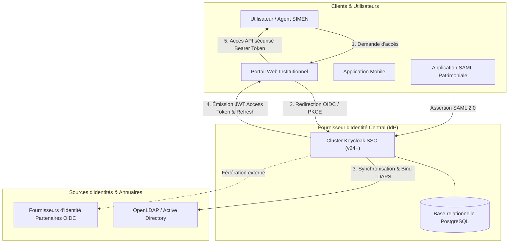

# Solution d'Authentification Unique (SSO) & Fédération d'Identités

> **Projet de Fin d'Études — Master 2 RESI (Réseaux & Systèmes Informatiques)**  
> **Auteur** : Ababacar Ousmane Niang  
> **Institution** : Groupe ISI Dakar (Institut Supérieur d'Informatique)  
> **Cadre Technique** : SIMEN (Système Intégré de Management de l'Éducation Nationale)

---

## Problématique & Objectifs Stratégiques

Dans les organisations publiques et institutionnelles, la multiplication des silos applicatifs et des annuaires d'utilisateurs pose des défis de sécurité et d'exploitabilité :
- **Risques liés à la gestion des identités** : dispersion des mots de passe, absence de politique uniforme de complexité et risque accru de compromission d'accès.
- **Complexité opérationnelle** : lourdeur administrative lors des processus d'onboarding, de modification des droits et de révocation des accès (offboarding).
- **Auditabilité et traçabilité insuffisantes** : éclatement des journaux de connexion et difficulté d'analyser les flux d'authentification en temps réel.
- **Souveraineté des données** : nécessité de maîtriser l'hébergement et la gouvernance des identités numériques sans dépendre de prestataires SaaS tiers fermés.

Ce projet apporte une réponse technique et souveraine via le déploiement d'une plateforme **IAM (Identity & Access Management)** centralisée reposant sur **Keycloak**, intégrant les protocoles standards **OpenID Connect (OIDC)**, **SAML 2.0**, **OAuth 2.0** et l'annuaire d'entreprise **LDAP / Active Directory**.

---

## Architecture Globale de la Solution



---

## Caractéristiques Techniques & Fonctionnalités Clés

1. **Fédération d'Identités Multi-Sources** :
   - Synchronisation bidirectionnelle avec **OpenLDAP** et **Active Directory**.
   - Prise en charge du protocole Kerberos / SPNEGO pour l'authentification transparente au sein du domaine.

2. **Standards Cryptographiques et Protocolaires** :
   - **OpenID Connect (OIDC)** et **OAuth 2.0** avec Authorization Code Flow et **PKCE** (Proof Key for Code Exchange) pour les applications clientes.
   - **SAML 2.0 Web Browser SSO Profile** garantissant l'interopérabilité avec les applications métier existantes.
   - Signature asymétrique des jetons JWT en **RS256** avec rotation périodique des clés de signature.

3. **Sécurité et Gouvernance des Accès** :
   - **Authentification Multifacteur (MFA)** obligatoire via applications OTP (FreeOTP, Google Authenticator) ou clés physiques FIDO2 / WebAuthn.
   - Mécanismes de protection contre les attaques par force brute (temporisation, verrouillage de compte).
   - Contrôle d'accès basé sur les rôles (**RBAC**) et sur les attributs (**ABAC**).

4. **Résilience et Exploitation** :
   - Déploiement conteneurisé reproductible orchestré via Docker Compose, compatible avec un cluster Kubernetes.
   - Persistance des sessions et gestion du cache distribué sous Infinispan.

---

## Démarrage du Lab (Docker Compose)

### Prérequis
- Docker Engine 20.10+
- Docker Compose v2+

### Procédure de déploiement
```bash
docker compose up -d
```

### Inventaire des services :
| Service | Nom du conteneur | Port d'écoute | Description fonctionnelle |
| :--- | :--- | :--- | :--- |
| **Keycloak IDP** | `simen-keycloak-idp` | `http://localhost:8080` | Fournisseur d'identité centralisé (Admin: `admin` / `admin_simen_sso`) |
| **PostgreSQL** | `simen-postgres-db` | `5432` (réseau interne) | Base relationnelle des configurations de realms, rôles et sessions |
| **OpenLDAP** | `simen-openldap` | `389` | Annuaire d'entreprise souverain (`dc=simen,dc=sn`) |
| **phpLDAPadmin** | `simen-phpldapadmin` | `http://localhost:8081` | Interface d'administration pour la gestion de l'annuaire |

---

## Documentation et Livrables Associés

Les supports d'architecture et documents de soutenance sont consultables dans le répertoire `docs/` :
- [`SIMEN_Sovereign_SSO_Architecture.pptx`](./docs/SIMEN_Sovereign_SSO_Architecture.pptx) : Document d'architecture exécutive.
- [`sso_ci_presentation.pptx`](./docs/sso_ci_presentation.pptx) : Support de présentation technique sur l'intégration continue et le SSO.
- [`SSO_Cl.pdf`](./docs/SSO_Cl.pdf) : Fiche de synthèse technique du cas d'usage institutionnel.
