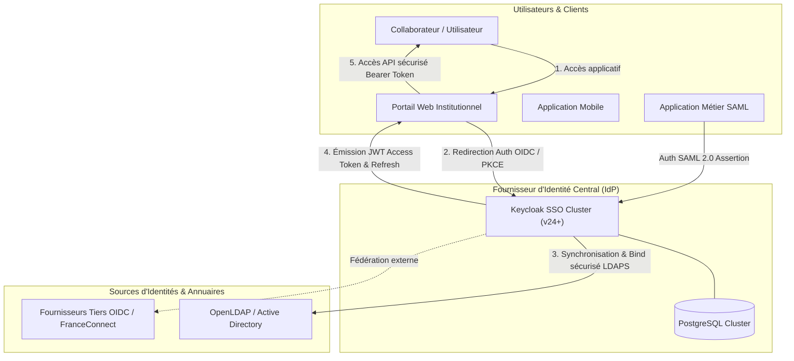

# 🔐 Solution d'Authentification Unique (SSO) & Fédération d'Identités

> **Projet de Fin d'Études — Master 2 RESI (Réseaux & Systèmes Informatiques)**  
> **Auteur** : Ababacar Ousmane Niang  
> **Institution** : Groupe ISI Dakar (Institut Supérieur d'Informatique)  
> **Cadre** : SIMEN (Système d'Information et de Management de l'Éducation Nationale)

---

## 🎯 Problématique & Objectifs Stratégiques

Dans les organisations modernes et les systèmes d'information étatiques/institutionnels, la démultiplication des comptes utilisateurs engendre des risques majeurs :
- **Fatigue des mots de passe** et vulnérabilités humaines accrues (réutilisation d'identifiants faibles).
- **Complexité d'administration** lors de l'onboarding/offboarding des collaborateurs.
- **Absence de traçabilité unifiée** des sessions et des accès critiques.
- **Enjeux de souveraineté numérique des données** face aux solutions propriétaires hébergées hors frontières.

Ce projet conçoit et déploie une infrastructure **IAM (Identity & Access Management)** souveraine, unifiée, hautement disponible et sécurisée, basée sur **Keycloak**, articulée autour des standards ouverts **OpenID Connect (OIDC)**, **SAML 2.0**, **OAuth 2.0** et d'un annuaire d'identités **LDAP / Active Directory**.

---

## 🏗️ Architecture Globale de la Solution



---

## ⚡ Caractéristiques Techniques & Fonctionnalités Clés

1. **Fédération d'Identités Multi-Sources** :
   - Synchronisation bidirectionnelle avec **OpenLDAP** et **Active Directory**.
   - Prise en charge du protocole Kerberos / SPNEGO pour un SSO transparent sur les postes de travail du domaine.

2. **Protocoles & Standards Cryptographiques** :
   - **OpenID Connect (OIDC)** et **OAuth 2.0** avec Authorization Code Flow + **PKCE** (Proof Key for Code Exchange) pour les SPA et applications mobiles.
   - **SAML 2.0 Web Browser SSO Profile** pour la rétrocompatibilité des applications patrimoniales.
   - Signatures cryptographiques des tokens JWT avec clés asymétriques **RS256**.

3. **Sécurité Renforcée & Politiques d'Accès** :
   - **MFA (Authentification Multifacteur)** obligatoire via applications OTP (FreeOTP, Google Authenticator) ou clés de sécurité FIDO2 / WebAuthn.
   - Détection d'attaques par force brute, verrouillage temporaire de comptes et conformité mot de passe stricte.
   - Contrôle d'accès basé sur les rôles (**RBAC**) et les attributs (**ABAC**).

4. **Haute Disponibilité & Résilience** :
   - Déploiement conteneurisé scalable orchestré par Docker Compose et adaptable sous Kubernetes.
   - Persistance des états de session et cache distribué Infinispan.

---

## 🚀 Démarrage Rapide du Lab (Docker Compose)

### Prérequis
- Docker Engine 20.10+
- Docker Compose v2+

### Déploiement en une commande
```bash
docker compose up -d
```

### Services instanciés :
| Service | Conteneur | Port d'écoute | Rôle |
| :--- | :--- | :--- | :--- |
| **Keycloak IDP** | `simen-keycloak-idp` | `http://localhost:8080` | Fournisseur d'identité centralisé (Admin: `admin` / `admin_simen_sso`) |
| **PostgreSQL** | `simen-postgres-db` | `5432` (interne) | Base relationnelle des realms, rôles et sessions |
| **OpenLDAP** | `simen-openldap` | `389` | Annuaire d'entreprise souverain (`dc=simen,dc=sn`) |
| **phpLDAPadmin** | `simen-phpldapadmin` | `http://localhost:8081` | Console web d'administration de l'annuaire LDAP |

---

## 📂 Documents et Présentations du Projet

Les supports officiels de soutenance et documents d'architecture sont archivés dans le dossier `docs/` :
- [`SIMEN_Sovereign_SSO_Architecture.pptx`](./docs/SIMEN_Sovereign_SSO_Architecture.pptx) : Présentation exécutive de l'architecture cible.
- [`sso_ci_presentation.pptx`](./docs/sso_ci_presentation.pptx) : Diaporama technique de démonstration d'intégration continue et SSO.
- [`SSO_Cl.pdf`](./docs/SSO_Cl.pdf) : Fiche de synthèse et cas d'usage institutionnel.
