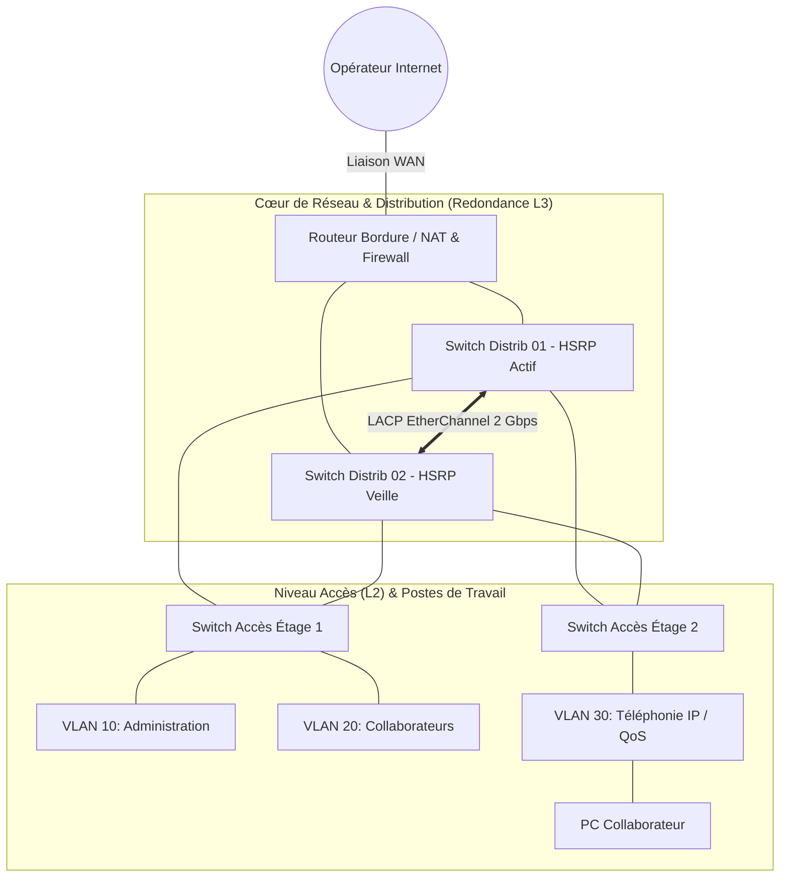

# 🌐 Ingénierie Réseaux Cisco & Huawei Datacenter

> **Projets & Travaux Pratiques Avancés — Master 1 & Master 2 RESI**  
> **Auteur** : Ababacar Ousmane Niang  
> **Certifications associées** : Cisco CCNA (1, 2, 3), Préparation CCNP ENCOR & Huawei HCIP Datacenter (DCN)

---

## 🎯 Périmètre Technique & Compétences Clés

Ce dossier regroupe les topologies de référence, les maquettes de simulation et les configurations réseau conçues pour des environnements d'entreprise exigeants en haute disponibilité, redondance et sécurité :

- **Routage Dynamique & WAN** : OSPFv2/OSPFv3 multi-zones, BGP (eBGP/iBGP), MPLS LDP, VRF (Virtual Routing and Forwarding), redistribution de routes et filtrage par Route-Maps.
- **Commutation Haute Disponibilité (L2/L3)** : VLANs (802.1Q), Trunking, EtherChannel (LACP/PAgP), Spanning-Tree Protocol (RSTP / MSTP), routage Inter-VLAN (SVI).
- **Résilience & Redondance de Passerelle (FHRP)** : HSRP (Hot Standby Router Protocol) et VRRP (Virtual Router Redundancy Protocol) avec suivi d'interfaces (tracking).
- **Services IP & Optimisation** : DHCP Snooping, Dynamic ARP Inspection (DAI), NAT/PAT, QoS pour la Téléphonie sur IP (ToIP/VoIP avec priorisation DSCP/CoS).

---

## 🗺️ Topologie Type d'Entreprise (Core / Distribution / Access)



---

## 📁 Contenu du Dossier & Labs Disponibles

### 1. Fichiers de Simulation Packet Tracer (`labs/`)
- [`Topologie_Routage_Entreprise_M1.pkt`](./labs/Topologie_Routage_Entreprise_M1.pkt) : Maquette réseau multi-sites d'Ababacar Ousmane Niang avec découpage VLSM et routage inter-sites.
- [`Partie_Routage.docx`](./labs/Partie_Routage.docx) : Cahier des charges technique et explications pas-à-pas de l'adressage et des métriques de routage.
- [`DHCP_Infrastructure_M2.pkt`](./labs/DHCP_Infrastructure_M2.pkt) : Infrastructure avec relais DHCP (`ip helper-address`), pools dédiés et exclusion d'adresses d'administration.
- [`ToIP_VoIP_QoS_M1.pkt`](./labs/ToIP_VoIP_QoS_M1.pkt) : Déploiement VoIP avec serveurs d'appels Cisco CME, routage de flux vocaux et files d'attente prioritaires QoS.

### 2. Scripts et Fichiers de Configuration (`configs/`)
- [`cisco-core-routing.cfg`](./configs/cisco-core-routing.cfg) : Script complet prêt à injecter en console pour la mise en place d'un commutateur de distribution L3 et d'un routeur de bordure avec NAT/PAT.

---

## 📊 Matrice d'Adressage & Plan de VLANs

| VLAN ID | Nom du Réseau | Sous-réseau (CIDR) | Passerelle Virtuelle (HSRP/VRRP) | Rôle |
| :---: | :--- | :--- | :--- | :--- |
| **10** | `ADMINISTRATION_MGMT` | `192.168.10.0/24` | `192.168.10.1` | Postes admins, serveurs sensibles, bastion SSH |
| **20** | `DATA_SERVICES` | `192.168.20.0/24` | `192.168.20.1` | Postes de travail des collaborateurs |
| **30** | `VOIP_TELEPHONIE` | `192.168.30.0/24` | `192.168.30.1` | Téléphonie IP Cisco, serveurs CallManager |
| **99** | `NATIVE_MGMT` | `192.168.99.0/24` | `192.168.99.1` | VLAN natif et interfaces d'administration des switchs |

---

## 🛠️ Commandes de Vérification & Diagnostic Cisco IOS

```bash
# Vérification du voisinage OSPF
SW-DISTRIB-01# show ip ospf neighbor

# Contrôle de la table de routage globale
SW-DISTRIB-01# show ip route

# État des liens agrégés EtherChannel
SW-DISTRIB-01# show etherchannel summary

# Contrôle de la redondance de passerelle HSRP
SW-DISTRIB-01# show standby brief

# Vérification des translations NAT dynamiques
R-EDGE-WAN-01# show ip nat translations
```
