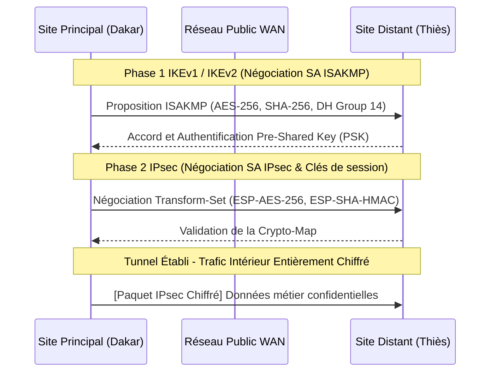

# 🛡️ Cybersécurité, Filtrage Avancé & Durcissement des Systèmes

> **Projets & Travaux Pratiques de Sécurité — Master 1 RESI**  
> **Auteur** : Ababacar Ousmane Niang  
> **Institution** : Groupe ISI Dakar

---

## 🎯 Enjeux & Objectifs du Projet

La protection d'un système d'information repose sur le principe de **défense en profondeur**. Ce dossier rassemble les implémentations pratiques relatives à la sécurisation des couches basses (Niveau 2 Commutation), à l'interconnexion sécurisée de sites distants par tunnel chiffré (**VPN IPsec**), et au cloisonnement des flux à travers une architecture **DMZ (Zone Démilitarisée)**.

---

## 🔒 1. Sécurité de Couche 2 (Layer 2 Security)

Les attaques réseau internes exploitent souvent les faiblesses inhérentes aux protocoles Ethernet et ARP. Les contre-mesures mises en œuvre comprennent :

- **Port Security** : Limitation du nombre d'adresses MAC par port d'accès, apprentissage dynamique (`sticky MAC`) et mise en quarantaine (`errdisable / shutdown`) en cas de tentative de substitution.
- **DHCP Snooping** : Définition de ports de confiance (`trusted`) et non fiables (`untrusted`) pour neutraliser les serveurs DHCP pirates (Rogue DHCP) et les attaques par épuisement de pool (DHCP Starvation).
- **Dynamic ARP Inspection (DAI)** : Validation systématique des paquets ARP en croisant les adresses IP/MAC avec la base de données DHCP Snooping pour bloquer les attaques de type Man-in-the-Middle (ARP Poisoning).
- **STP Guarding (BPDU Guard & Root Guard)** : Protection de l'arbre Spanning-Tree contre l'injection de commutateurs non autorisés.

---

## 🌐 2. Tunnel Chiffré VPN IPsec Site-à-Site

Interconnexion sécurisée de deux sites d'entreprise distants à travers un réseau WAN public non sécurisé via **IPsec (Internet Protocol Security)** :

### Paramètres Cryptographiques Retenus :
- **Chiffrement** : AES-256 (Advanced Encryption Standard).
- **Intégrité / Hachage** : SHA-256 (Secure Hash Algorithm).
- **Échange de clés** : Diffie-Hellman Groupe 14 (2048-bit).
- **Mode d'encapsulation** : ESP (Encapsulating Security Payload) en mode tunnel.

---

## 🏰 3. Architecture DMZ & Pare-Feu

Conception d'une zone démilitarisée pour isoler les services publics (Serveur Web, Serveur DNS, Messagerie) du réseau local d'entreprise (LAN privé) :
- **Règle du moindre privilège** : Aucun flux initié depuis la DMZ vers le réseau interne n'est autorisé.
- **Filtrage applicatif** : Contrôle strict des ports (`TCP 80/443` vers le Web, `UDP/TCP 53` pour le DNS).
- **Journalisation & Alerting** : Traçabilité des tentatives d'intrusion et rejets de paquets.

---

## 📂 Fichiers et Travaux Pratiques (`labs/` & `docs/`)

- [`Ababacar_Ousmane_Niang_Layer2_Security.pka`](./labs/Ababacar_Ousmane_Niang_Layer2_Security.pka) : Activité Packet Tracer guidée et validée sur la sécurisation de la commutation.
- [`Ababacar_Ousmane_Niang_Site_to_Site_IPsec_VPN.pka`](./labs/Ababacar_Ousmane_Niang_Site_to_Site_IPsec_VPN.pka) : Déploiement complet en CLI du tunnel VPN IPsec avec vérification des associations de sécurité (`show crypto isakmp sa`, `show crypto ipsec sa`).
- [`DMZ_Architecture.pkt`](./labs/DMZ_Architecture.pkt) : Maquette réseau de la DMZ multi-zones.
- [`PROJET_SECURITE_RESEAUX.pdf`](./docs/PROJET_SECURITE_RESEAUX.pdf) : Rapport académique complet du projet de sécurité des réseaux.
