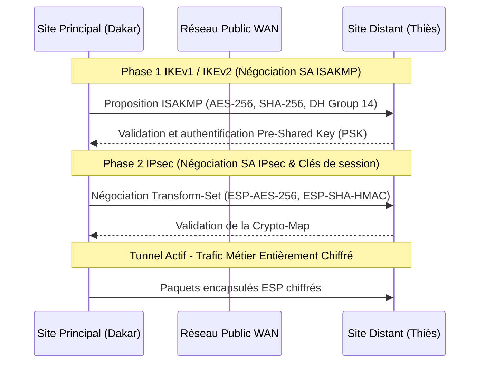

# Cybersécurité, Filtrage Avancé & Durcissement des Systèmes

> **Projets & Travaux d'Ingénierie Sécurité — Master 1 RESI**  
> **Auteur** : Ababacar Ousmane Niang  
> **Institution** : Groupe ISI Dakar

---

## Enjeux & Objectifs d'Ingénierie

La protection d'un système d'information s'appuie sur le principe de **défense en profondeur**. Ce dossier réunit les travaux pratiques portant sur la sécurisation des couches de liaison (Niveau 2 Commutation), l'interconnexion chiffrée de sites distants par **VPN IPsec**, et le cloisonnement étanche des flux au moyen d'une **DMZ (Zone Démilitarisée)**.

---

## 1. Sécurité de Couche 2 (Layer 2 Hardening)

Les protocoles Ethernet et ARP sont dépourvus de mécanismes d'authentification natifs. Les contre-mesures déployées sur les commutateurs incluent :

- **Port Security** : Contrôle du nombre d'adresses MAC par port d'accès, apprentissage dynamique (`sticky MAC`) et mise hors service automatique (`errdisable / shutdown`) en cas de tentative d'usurpation.
- **DHCP Snooping** : Distinction stricte entre ports fiables (`trusted`) et non fiables (`untrusted`) pour empêcher l'introduction de serveurs DHCP pirates (Rogue DHCP) et les attaques par saturation de pool (DHCP Starvation).
- **Dynamic ARP Inspection (DAI)** : Interception et validation des requêtes et réponses ARP par comparaison avec la base de baux DHCP Snooping pour neutraliser les attaques de type Man-in-the-Middle (ARP Poisoning).
- **STP Guarding (BPDU Guard & Root Guard)** : Protection de la topologie Spanning-Tree contre l'injection illégitime de priorités de pont racine.

---

## 2. Interconnexion Chiffrée par VPN IPsec Site-à-Site

Interconnexion sécurisée de deux sites d'entreprise distants à travers un réseau WAN public non sécurisé via le standard **IPsec (Internet Protocol Security)** :

### Paramètres Cryptographiques Retenus :
- **Algorithme de chiffrement** : AES-256 (Advanced Encryption Standard).
- **Algorithme d'intégrité / hachage** : SHA-256 (Secure Hash Algorithm).
- **Échange de clés Diffie-Hellman** : Groupe 14 (2048-bit).
- **Mode d'encapsulation** : ESP (Encapsulating Security Payload) en mode tunnel.

---

## 3. Segmentation Réseau & Architecture DMZ

Conception d'une zone démilitarisée pour isoler les services publiquement accessibles (serveurs Web, serveurs DNS, passerelles) de l'intranet privé :
- **Principe du moindre privilège** : Interdiction formelle de tout flux initié depuis la zone DMZ vers le réseau interne privé.
- **Filtrage d'état (Stateful Firewall)** : Autorisation stricte des seuls flux applicatifs requis (`TCP 80/443` pour HTTP/HTTPS, `UDP/TCP 53` pour le DNS).
- **Journalisation des événements** : Audit continu des connexions établies et des rejets de paquets.

---

## Travaux Pratiques & Documentation Technique

- [`Ababacar_Ousmane_Niang_Layer2_Security.pka`](./labs/Ababacar_Ousmane_Niang_Layer2_Security.pka) : Atelier pratique Packet Tracer validant le durcissement de commutateurs L2.
- [`Ababacar_Ousmane_Niang_Site_to_Site_IPsec_VPN.pka`](./labs/Ababacar_Ousmane_Niang_Site_to_Site_IPsec_VPN.pka) : Déploiement CLI du tunnel IPsec et vérification des associations de sécurité (`show crypto isakmp sa`, `show crypto ipsec sa`).
- [`DMZ_Architecture.pkt`](./labs/DMZ_Architecture.pkt) : Maquette réseau illustrant le cloisonnement multi-zones.
- [`PROJET_SECURITE_RESEAUX.pdf`](./docs/PROJET_SECURITE_RESEAUX.pdf) : Rapport technique détaillé du projet de sécurisation.
