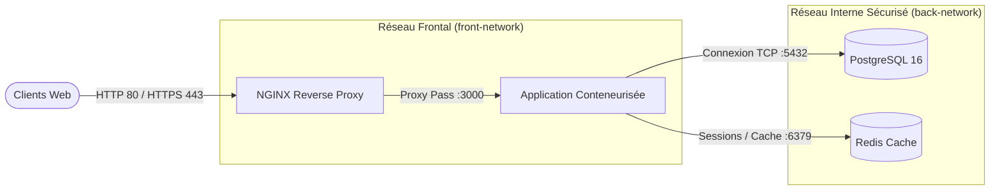

# ⚙️ DevOps, Conteneurisation & Architecture MultiCloud

> **Spécialisation Master 2 RESI (Réseaux & Systèmes Informatiques)**  
> **Auteur** : Ababacar Ousmane Niang  
> **Outils** : Docker, Docker Compose, Kubernetes, AWS (IAM, EC2, VPC), GitHub Actions, NGINX

---

## 🎯 Objectifs de l'Ingénierie DevOps

L'ingénierie DevOps vise à combler le fossé entre développement et exploitation système par la standardisation des environnements, l'automatisation des déploiements et l'assurance de la haute disponibilité :
- **Immutabilité des environnements** via des conteneurs légers et reproductibles.
- **Sécurisation (Container Hardening)** : Exécution systématique en utilisateur non-privilégié (`non-root`), images minimales basées sur Alpine Linux, et multi-stage build pour éliminer les outils de compilation du runtime final.
- **Isolation des couches réseau** : Ségrégation stricte des flux (`front-network` pour le reverse proxy et `back-network` pour la base de données et le cache).

---

## 🏗️ Architecture Multi-Tiers Conteneurisée



---

## 🚀 Utilisation & Déploiement

### 1. Démarrage de la stack complète
```bash
docker compose up -d
```

### 2. Surveillance et vérification d'état
```bash
docker compose ps
docker compose logs -f webapp
```

---

## ☁️ Compétences Cloud & Infrastructure as Code (AWS)
- **AWS IAM** : Politiques de moindres privilèges, groupes, rôles d'instances EC2 et authentification multi-facteurs (MFA).
- **AWS Networking** : Configuration de VPCs, sous-réseaux publics/privés, tables de routage et passerelles Internet (IGW).
- **Intégration Continue (CI/CD)** : Pipelines GitHub Actions automatisant les tests unitaires, la construction d'artefacts et le déploiement sur GitHub Pages.
