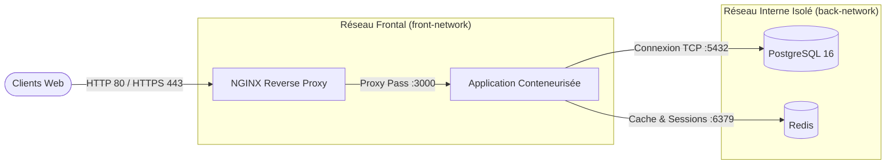

# DevOps, Conteneurisation & Architecture Multi-Tiers

> **Spécialisation Master 2 RESI (Réseaux & Systèmes Informatiques)**  
> **Auteur** : Ababacar Ousmane Niang  
> **Outils & Technologies** : Docker, Docker Compose, Kubernetes, AWS (IAM, EC2, VPC), GitHub Actions, NGINX

---

## Principes & Objectifs Opérationnels

L'ingénierie DevOps mise en œuvre répond à trois exigences majeures d'exploitabilité et de sécurité :
- **Immutabilité des environnements** : encapsulation des dépendances applicatives au sein d'images conteneurisées reproductibles.
- **Durcissement des conteneurs (Container Hardening)** : utilisation d'images de base minimales (Alpine Linux), exclusion des utilitaires de build du runtime via le patron *multi-stage build*, et exécution sous compte de service non privilégié (`non-root`).
- **Cloisonnement réseau par couches** : segmentation réseau interne sous Docker (`front-network` exposé pour le reverse proxy et `back-network` isolé pour la persistance et le cache).

---

## Architecture Multi-Tiers Conteneurisée



---

## Déploiement & Exploitation

### 1. Démarrage de la stack de services
```bash
docker compose up -d
```

### 2. Surveillance et contrôle d'état
```bash
docker compose ps
docker compose logs -f webapp
```

---

## Compétences Cloud & Automatisation

- **AWS IAM & Sécurité** : Gestion des politiques de moindre privilège, groupes d'utilisateurs, rôles d'instances EC2 et obligation du MFA.
- **AWS Réseau** : Implémentation de VPCs, sous-réseaux publics et privés, passerelles Internet (IGW) et tables de routage associées.
- **Automatisation CI/CD** : Conception de pipelines GitHub Actions validant le code source, construisant les artefacts et automatisant le déploiement sur GitHub Pages.
